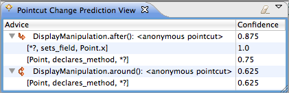
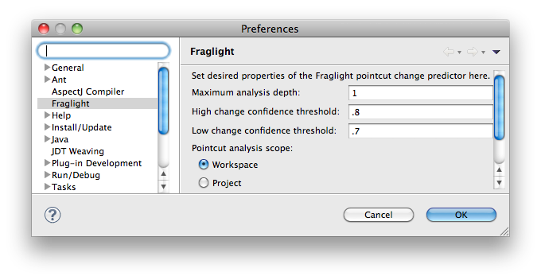
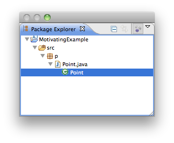
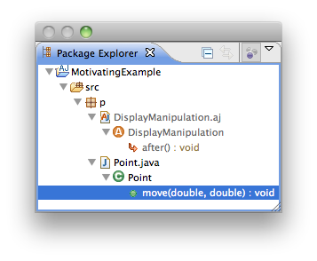

# fraglight

 A tool for early detection of broken pointcuts in evolving Aspect-Oriented software.

## Introduction

Pointcut fragility is a well-documented problem in Aspect-Oriented Programming; changes to the base-code can lead to join points incorrectly falling in or out of the scope of pointcuts. Deciding which pointcuts have broken because of changes made to the base-code is a daunting venture, especially in large and complex systems.

*fraglight*, an extension of the Mylyn Eclipse plug-in, which maintains focused contexts of entities relevant to a task, is a research prototype that recommends a set of AspectJ pointcuts that are likely to require modification due to a particular base-code change. The underlying approach is based on harnessing unique and arbitrarily deep structural commonality between program elements corresponding to join points selected by a pointcut in a particular software version. Patterns describing such commonality are used to recommend pointcuts that have potentially broken with a degree of change confidence as the developer is typing. More information can be found at the [project website](http://openlab.citytech.cuny.edu/pcp). The plug-in can be installed using the update site listed below.

## Update Site

https://raw.githubusercontent.com/khatchad/fraglight/master/edu.ohio_state.cse.khatchad.fraglight.updatesite/

## Usage

*fraglight* starts working when a Mylyn task is activated for an AspectJ project. There is a preference pane that can control some of the plug-in's behaviors:

Parameter descriptions are as follows:

| Parameter | Description |
|:-----------------------|:------------------------------------------------------------------------------------------|
| Maximum analysis depth | Controls the analysis tractability by limiting the depth of the relationships considered. |
| High change confidence threshold | The change confidence is the deemed probability that a pointcut needs to change given a change in the base-code. The closer the confidence is to 1, the more likely the pointcut has broken. This parameter controls the "high" threshold; only predictions with this confidence value and higher are processed. |
| Low change confidence threshold | Similar to the high threshold but controls the lower portion of the confidence spectrum. Predictions having confidence levels from 0 to this specified value are processed. This is necessary because *fraglight* also detects _unbroken_ pointcuts. |
| Pointcut analysis scope | Also controls the analysis tractability by limiting the number of projects to be analyzed. The workspace scope considers all projects in the workspace, whereas the project scope considers only the immediate project. |

## Screenshots

| Before | After |
|:-------------------------------------------------------------------------------------------------------------------------------------------------------------------------------------------------------------------------|:----------------------------------------------------------------------------------------------------------------------------------------------------------------------------------------------------------------------------|
| The package explorer, one view that *fraglight* manipulates as part of Mylyn, before breaking a pointcut. The view is controlled by Mylyn and a Mylyn task is activated. Notice that no pointcuts are present in the view: | The same view after a pointcut breakage. The broken pointcut is added to the Mylyn context automatically. This alerts developers that they may have written base-code that has broken pointcuts, all while they are typing: |
|                                                               |                                                                    |

## Demonstration
You may find a demonstration showing how *fraglight* manipulates the Mylyn context using a simple use case [here](http://www.screencast.com/t/6LEmVUEpntm).

## News

Please subscribe to our [google group](http://groups.google.com/group/fraglight-announce) for announcements. You may also join our [developer discussion](http://groups.google.com/group/pointcut-change-prediction).

## Limitations

Due to a present [Eclipse framework limitation](https://bugs.eclipse.org/bugs/show_bug.cgi?id=310046), the AJDT is not able to reconcile AspectJ code without first saving it to disk. As such, our prototype implementation saves the current editor buffer every time it detects a new join point has being added. We plan to add in-memory reconciliation to the AJDT as part of [issue #1](https://github.com/khatchad/fraglight/issues/1) to make fraglight would be more developer-friendly.
